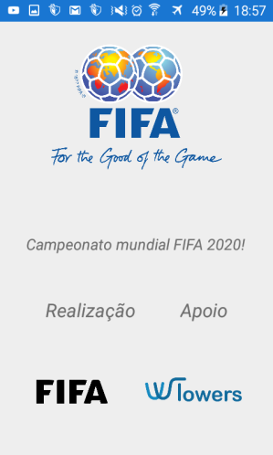
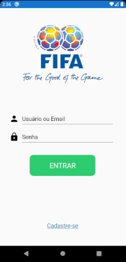
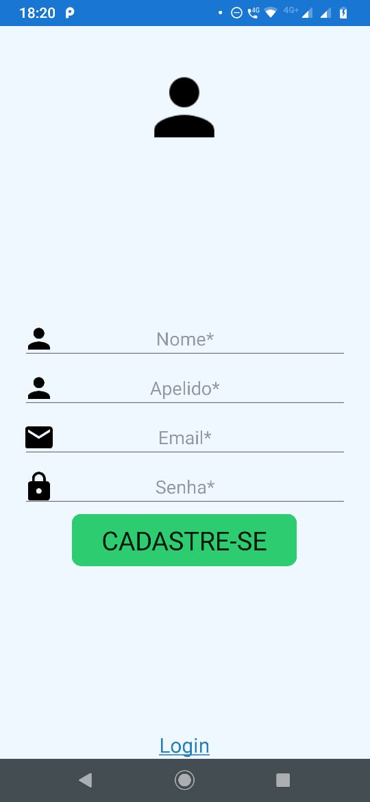
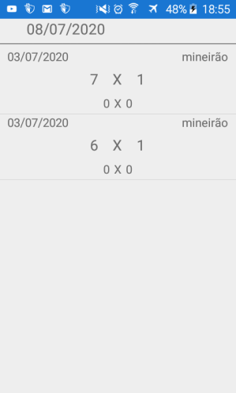

# CampeonatoApp :fire:

**Aplicativo desenvolvido com Xamarin**

O projeto teve de ser separado em 3 soluções diferentes. Abaixo está os links para cada branch com sua respectiva solução.
Para facilitar as imagens das telas prontas estão neste README. Tentaremos consertar o problema em breve, desculpem-nos pelo transtorno.

### Branches

- [Splash & Principal](https://github.com/marcostomas/CampeonatoApp/tree/Douglas-Principal-Splash "Nome da Pasta onde está o projeto: WTowerAndroid-Douglas")
- [Login](https://github.com/marcostomas/CampeonatoApp/tree/Login "Nome da pasta onde está o projeto: Campeonato_App")
- [Cadastro](https://github.com/marcostomas/CampeonatoApp/tree/marcos "Nome da Pasta onde está o projeto: Campeonato_App")

## Colaboradores

- [André Akira](https://github.com/DevAndreAkira "André Akira")
- [Douglas Mantovani](https://github.com/Douglasmantovani "Douglas Mantovani")
- [Marcos Tomás](https://github.com/marcostomas "Marcos Tomás")
- [Thiago Silva](https://github.com/Thihenriquesilva "Thiago Silva")
